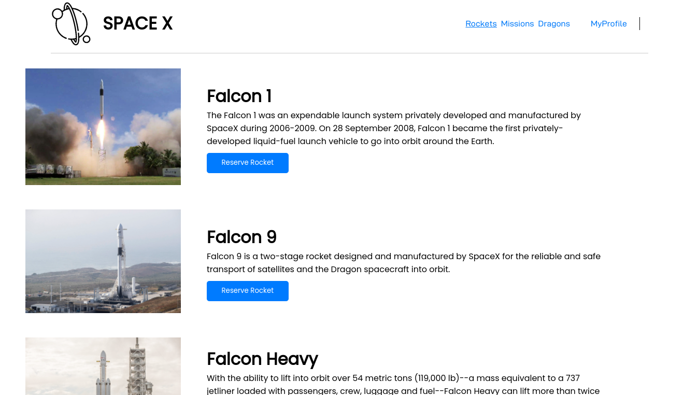

# Space Traveler



[Project Demo]()

> Space Traveler's website was built with real live data from the SpaceX API. The application provides commercial and scientific space travel services that allow users book rockets and join selected space missions.

Additional description about the project and its features.

## Built With

- Major languages (HTML, CSS, JavaScript)

- Frameworks / Libraries

  ```bash
  - React (Front end library)
  - React Testing Library
  - Jest(for testing)
  - Git(version control)
  - ESLint(JavaScript linting)
  - Stylelint(style linting)
  ```

- Technologies used

  ```bash
  - Git(version control)
  ```

## Getting Started

To get a local copy up and running follow these simple example steps.

### Prerequisites

- A text editor(preferably Visual Studio Code)

### Install

- [Git](https://git-scm.com/downloads)
- [Node](https://nodejs.org/en/download/)

### Usage

#### Clone this repository

```bash
$ git@github.com:iLynette/space-x.git
$ cd space-x
```

#### Run project

```bash
$ npm install
$ npm build
$ npm start
```

## Author

👤 **Fatemeh Zahra Arshia**

- GitHub: [@ZahraArshia](https://github.com/ZahraArshia)
- LinkedIn: [Zahra Arshia](https://www.linkedin.com/in/zahra-arshia/)

👤 **Lynette Aluoch**

- GitHub: [@iLynette](https://github.com/iLynette)
- Twitter: [@acholah_lynette](https://twitter.com/acholah_lynette)
- LinkedIn: [lynette-acholah](https://linkedin.com/in/lynette-acholah)

👤 **Vignesh**

- GitHub: [@vikipretium](https://github.com/vikipretium)
- Twitter: [@vikipretium](https://twitter.com/vikipretium)
- LinkedIn: [vikipretium](https://linkedin.com/in/vikipretium)

Contributions, issues, and feature requests are welcome!

Feel free to check the [issues page](../../issues/).

## Show your support

Give a ⭐️ if you like this project!

## Acknowledgments

- Hat tip to anyone whose code was used
- Inspiration
- etc

## 📝 License

This project is [MIT](./MIT.md) licensed.
